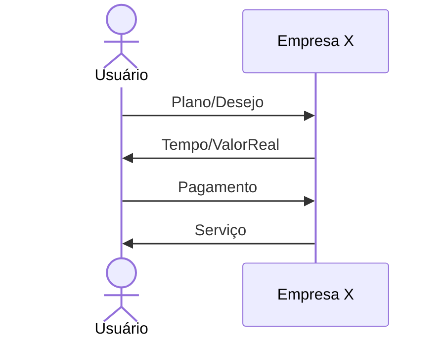
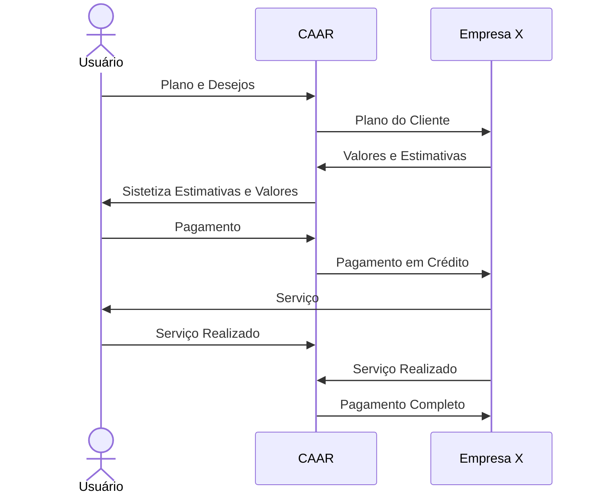

Aluno: Guilherme Caetano Gêa Martins  
Integrado: Grupo 1
# Projeto do Grupo 1 - Relatorio Individual
## Teste de Features _extras_ do Markdown:
O código a seguir renderiza um diagrama de fluxo Mermaid:

>```mermaid
>flowchart LR
>  A --> B
>```

Nota: Com a extenção de plugin nativo do Github a Mermaid, é possivel criar diagramas de nivel simples a detalhado dependendo do nivel de uso.  
Será usado para visualização base do programa.  
  
O código abaixo renderiza um diagrama sequencial Mermaid:

>```mermaid
>sequenceDiagram
>    Alice->>John: Hello John, how are you?
>    John-->>Alice: Great!
>    Alice-)John: See you later!
>```
Nota: Com a extenção de plugin nativo do Github a Mermaid, é possivel criar diagramas de nivel simples a detalhado dependendo do nivel de uso.  
Será usado para visualização base do programa.  

## Sobre o Programa C.A.A.R.:
Ao descorrer das aulas e discuções em grupo chegou-se a conclusão que nosso projeto final seria sobre um programa de Compra-Analise de Automações Rentaveis tanto para fins agricolas quanto para fins residenciais, mas só a base mesmo.  
O idealizado do projeto é algo proximo da Uber um programa que conecta/intermedia empresas de automação e o cliente/interessado, porém com mais proximidade da EasyEDA que se trata de um programa na qual é permitido criar um circuito eletrônico qualquer com peças do mercado, além de poder encomendar o circuito criado com a plataforma que repassa as peças requeridas a montadora e trasporta para o usuario que encomendou. Este seria o objetivo final do programa que está foram de ser possivel para o nosso nivél de conhecimento pois requer que saibamos muitas técnicas como um prorpio simulador de residencia ou então uma gerencia logica capaz de criar um link entre empresas e etc.
- Digrama da relação Pessoa x Empresa:

- Digrama da relação Pessoa x  Programa x Empresa (Idealizado):

## Programando (Back-End):
No quesito programação desenvolvi os caminhos para o funcionamento de duas funções do programa que são o Calcular e o Garantia, responsaveis por gerar os valores dos produtos e se for com "garantia" aumentar o preço.
Minha parte do projeto então costituiu se em interpretar o que já havia sido feito por meus colegas e então adaptar todo os os esqueletos a tornarem-se aptos a receber minha parte, e os plano que segui foi:  
1. Criar um meio de transformar a ObservableList em uma Array, pois não havia meio simples de coletar os dados dela;
> Então criando uma "variavel" do tipo Dispositivos[], ou seja, uma array simples, e usando o .toArray() na lista "dispositivos" consegui transportar os valores para o nosso modelo.

2. Criar os metodos no modelo para receberem os valores da View pelo Controler, sendo estes o calcular(recebendo 2 parametros) e o calcularEconomia(1 parametro);
> Estes foram bem simples pois envolvem em receber dois numeros, multiplicar e devolver os resultados.
     
3. Pensar em como desenvolver uma tabela em código, que é ineficaz mas funcional, que armazene os "valores de mercado" dos produtos;
> Utilizando as Arrays poderia-se criar uma forte tabela de vendas, mas tratando-se de um projeto pequeno optei por usar HashMap que é rápido combinado com o Map para organizar os dados, no fim isto trouxe dois imports,
> adições no inicialize() e um nomo metodo que gera a tabela de valores base dos produtos.
     
4. Conectar o meio anterior nos calculos e reescrever na tabela do programa para o usuário enxergar.
> Combinando a tabela de bases e os dados da tabela dispotitivos, convertendo e enviando pro modelo, foi possivel enfim receber os verdadeiros valores de cada item corretamente, faltando somente executar um tableView.refresh()
> que atualiza os dados da tabela com os novos dados calculados.
